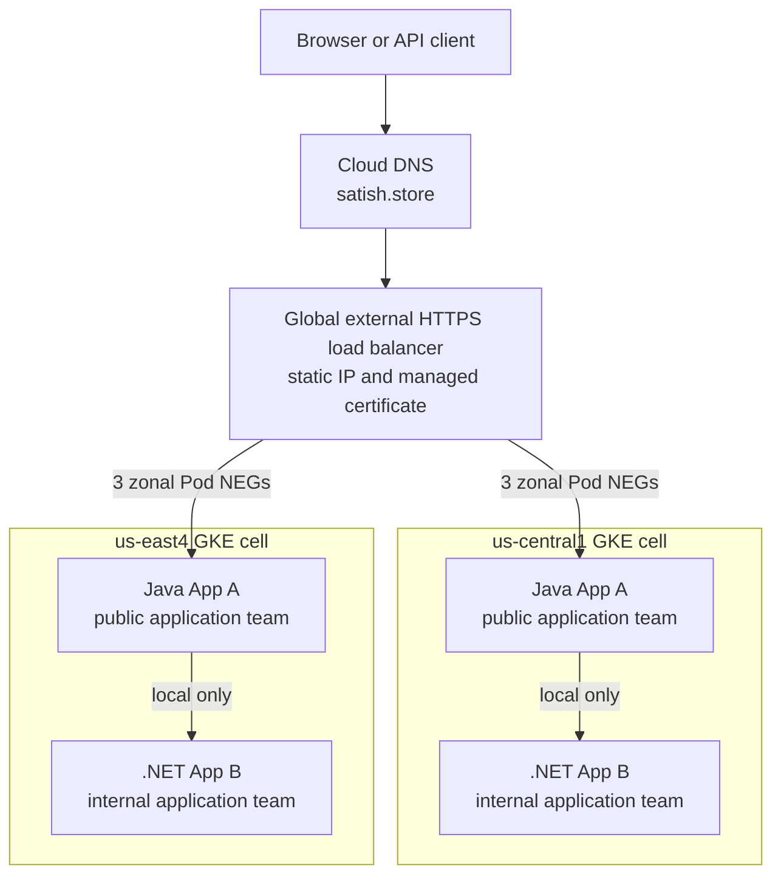
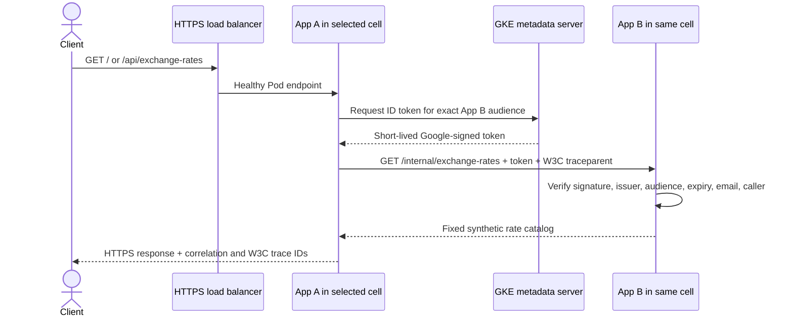
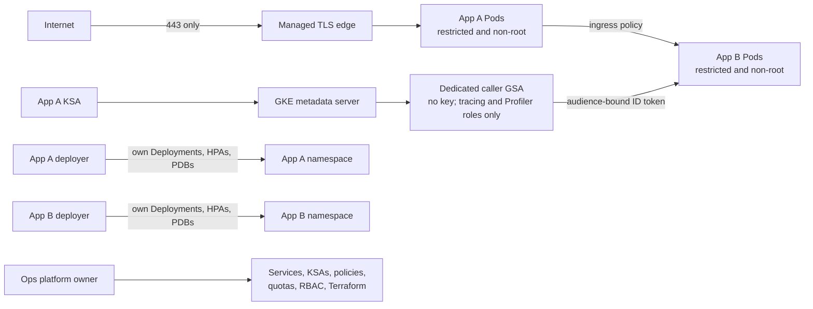
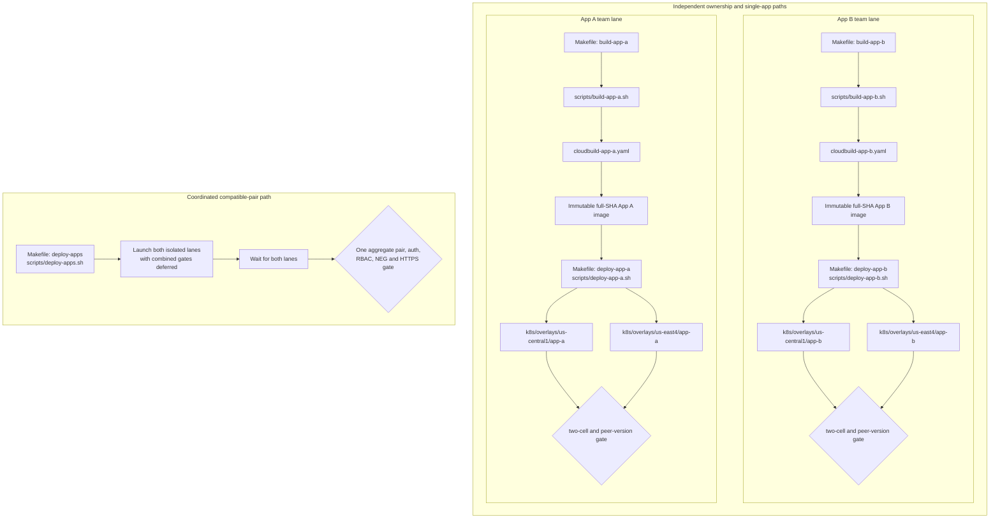
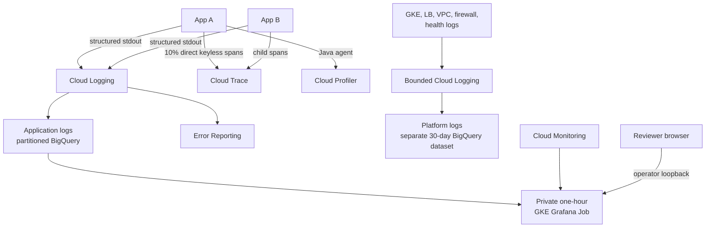
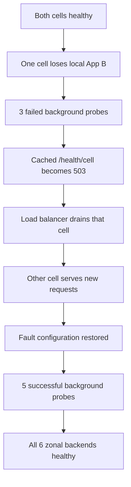

# Architecture

Two active regional GKE cells serve one global HTTPS endpoint. App A is public;
App B is private and cell-local. Each application has its own namespace,
runtime identity, deployer identity, and release lane.

## 1. High-level system

Terraform owns the global edge and attaches six zonal `GCE_VM_IP_PORT` NEGs
only after Kubernetes creates and populates them. App B has no public Service,
NEG, or cross-region dependency. There is no GKE Ingress controller: App A
Services register the Pod NEGs, and the Terraform load balancer routes directly
to those endpoints. Cloud DNS serves the public hostname; Kubernetes DNS serves
the cell-local App B name.

Static fallback: [`diagrams/01-high-level-system.png`](diagrams/01-high-level-system.png).

## 2. Request traffic and identity

TLS terminates at Google's edge; there is no public HTTP frontend. The internal
hop is ClusterIP HTTP. NetworkPolicy restricts who can reach it, while the
signed token authenticates who called it; neither control is presented as
mTLS.

Static fallback: [`diagrams/02-request-traffic-identity.png`](diagrams/02-request-traffic-identity.png).

## 3. Security and team boundaries

Both namespaces enforce restricted Pod Security, default-deny ingress, quotas,
and explicit NetworkPolicies. Containers run without privilege escalation as
non-root, with read-only root filesystems, dropped capabilities, and
`RuntimeDefault` seccomp. Deployer checks deny peer namespaces, Secrets,
policy/RBAC changes, exec, attach, and port-forward. Short-lived impersonation
and Workload Identity replace service-account keys. Guarded cloud/Terraform
entry points reject alternate token, credential-file, ADC, and impersonation
overrides before using the expected operator identity.

Developers work through the repository, pull-request review, CI/CD, and lower
environments. No developer production project or cluster principal is
provisioned, so Dev does not appear inside the production trust diagram.

This is a trusted-team boundary. The project, clusters, node plane, VPC,
registry, shared build identity, global edge, observability, and broad Ops
administrator remain shared blast-radius boundaries.

Static fallback: [`diagrams/03-security-team-boundaries.png`](diagrams/03-security-team-boundaries.png).

## 4. Independent build and deployment

The two teams have independent ownership, build definitions, deployer
identities, kubeconfigs, and single-app deployment commands. Each lane may
restore only its own prior immutable image. A direct single-app command runs
its combined compatibility gate and should not be raced against the other
direct command.

For two compatible changes released together, `make deploy-apps` is the safe
parallel path: it applies the platform, launches both isolated lanes with their
combined gates deferred, waits for both, then runs one authoritative aggregate
pair/auth/RBAC/NEG/HTTPS gate. Breaking contracts require expand-contract;
production would normally add progressive-region or canary rollout rather than
the assessment's parallel fast path.

| Step | App A lane | App B lane |
|---|---|---|
| Source | `apps/app-a-java/**` | `apps/app-b-dotnet/**` |
| Build entry | `Makefile build-app-a` -> `scripts/build-app-a.sh` | `Makefile build-app-b` -> `scripts/build-app-b.sh` |
| Build definition | `cloudbuild-app-a.yaml` | `cloudbuild-app-b.yaml` |
| Deploy entry | `Makefile deploy-app-a` -> `scripts/deploy-app-a.sh` | `Makefile deploy-app-b` -> `scripts/deploy-app-b.sh` |
| Regional desired state | `k8s/overlays/<region>/app-a` | `k8s/overlays/<region>/app-b` |

`cloudbuild-release.yaml` is a coordinated convenience for building a known
compatible pair. It is not the shared definition for the two independent
build lanes shown above. The coordinated deployment wrapper is `Makefile
deploy-apps` -> `scripts/deploy-apps.sh`; it is the only documented simultaneous
pair-release path.

Static fallback: [`diagrams/04-independent-build-deployment.png`](diagrams/04-independent-build-deployment.png).

## 5. Observability

The release proves two complementary correlation paths: `trace_id` joins
structured App A/App B logs in BigQuery, while Cloud Trace preserves the exact
App A server -> App A client -> App B server parent chain. App A also publishes
Java CPU and HEAP profiles. Export is asynchronous and sampled; no
observability component participates in request success, readiness, or
failover.

The separate bounded platform sink proved current GKE control-plane, node,
HPA, load-balancer, VPC-flow, and firewall activity plus node and HTTPS edge
metrics. Sampling bounds volume and is not complete forensic accounting.

The Grafana image is built in Artifact Registry with its checksum-pinned,
signed BigQuery plugin already baked in. The Job resolves its release tag to
one digest and downloads nothing at runtime. It is non-root, read-only,
deadline-bound to one hour, resource-bounded, and uses a dedicated keyless
reader identity. It has no Service, Ingress, Secret, PVC, or Kubernetes API
token; an operator loopback exposes it only during evidence capture.

Static fallback: [`diagrams/05-observability.png`](diagrams/05-observability.png).

## Implementation mapping

Exact technical names stay outside the diagrams so the drawings describe
business roles and regional boundaries clearly.

| Role | Implementation |
|---|---|
| Regional cells | One regional GKE cluster in central `b/c/f`; one in east `a/b/c` |
| App namespaces | `currency-app-a`, `currency-app-b` |
| Build lanes | `cloudbuild-app-a.yaml`, `cloudbuild-app-b.yaml` |
| Deploy lanes | `scripts/deploy-app-a.sh`, `scripts/deploy-app-b.sh`; simultaneous pair wrapper `scripts/deploy-apps.sh` |
| Platform desired state | `k8s/overlays/<region>/platform` |
| Global edge | `infra/30-lb`; one backend service over six zonal App A NEGs |
| Application logs | Existing partitioned application-log table; exact frozen identifier is documented in [`BIGQUERY.md`](BIGQUERY.md) |
| Platform logs | `currency_platform_logs` |
| Grafana image | `observability/grafana/Dockerfile` -> `cloudbuild-grafana.yaml` -> `scripts/build-grafana.sh` |
| Grafana runtime | `observability/grafana/kustomization.yaml`, `observability/grafana/gke/job.yaml`, `scripts/gke-grafana-evidence.sh` |

GitHub renders the six Mermaid diagrams directly from this file. The linked
static PNGs were also rendered successfully with pinned Mermaid CLI 11.12 so
reviewers without Mermaid support see the same source diagrams.

Exact frozen resource identifiers are intentionally kept out of this
architecture view. They remain available in the repository's `CONTRACTS.md`
and in this package's [`BIGQUERY.md`](BIGQUERY.md) where an implementation name
is necessary to run a query.

## 6. Regional failover

Kubernetes readiness deliberately does not depend on App B; a background probe
drives the separate load-balancer cell-health endpoint. The recorded exercise
automatically drained the affected cell, shifted new requests to the survivor,
restored the fault configuration, and recovered every backend. Exact measured
results are in [`EVIDENCE.md`](EVIDENCE.md); this is bounded recovery, not a
zero-downtime claim.

Getting closer to a production zero-downtime SLO would require capped retries
for idempotent GETs with backoff and jitter, faster health convergence, and
tested survivor capacity. That SLO and capacity work is outside this assessment.

Static fallback: [`diagrams/06-regional-failover.png`](diagrams/06-regional-failover.png).
