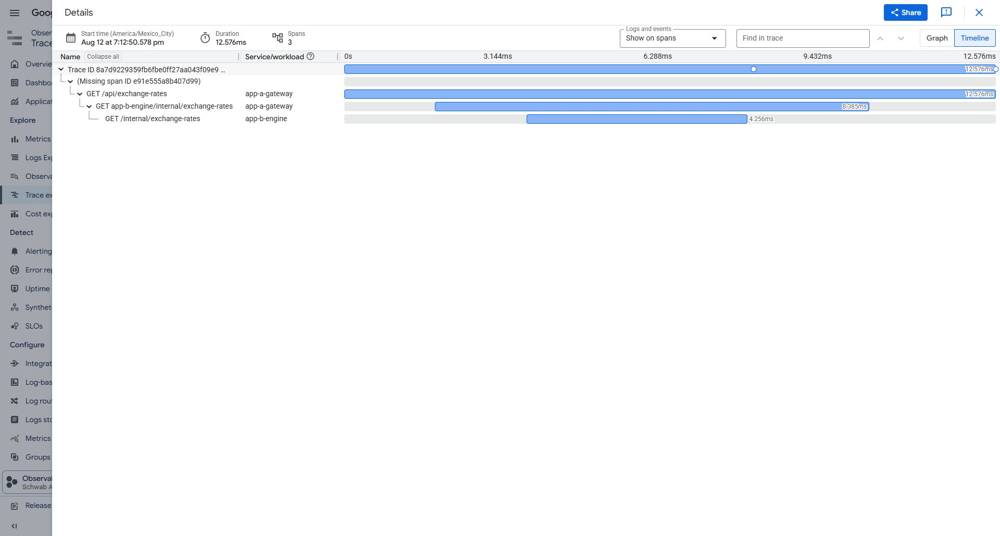
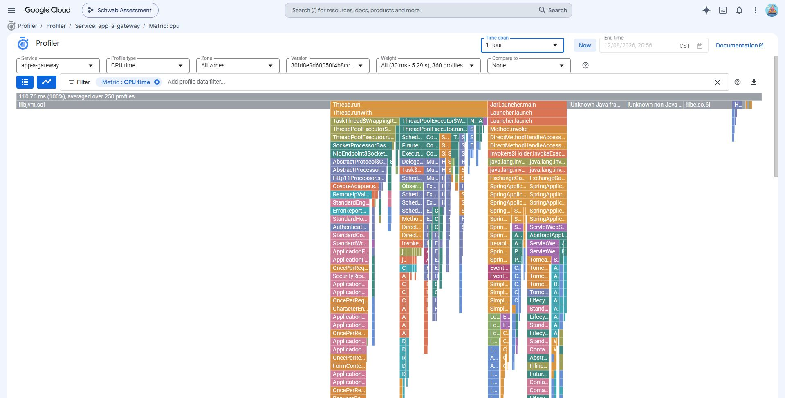
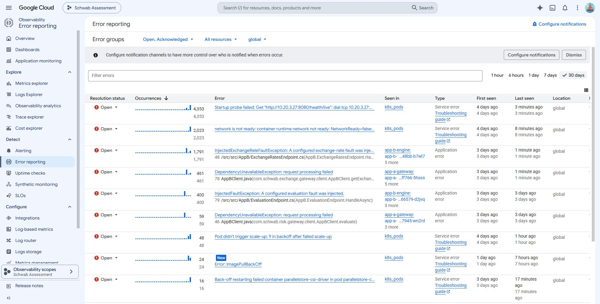
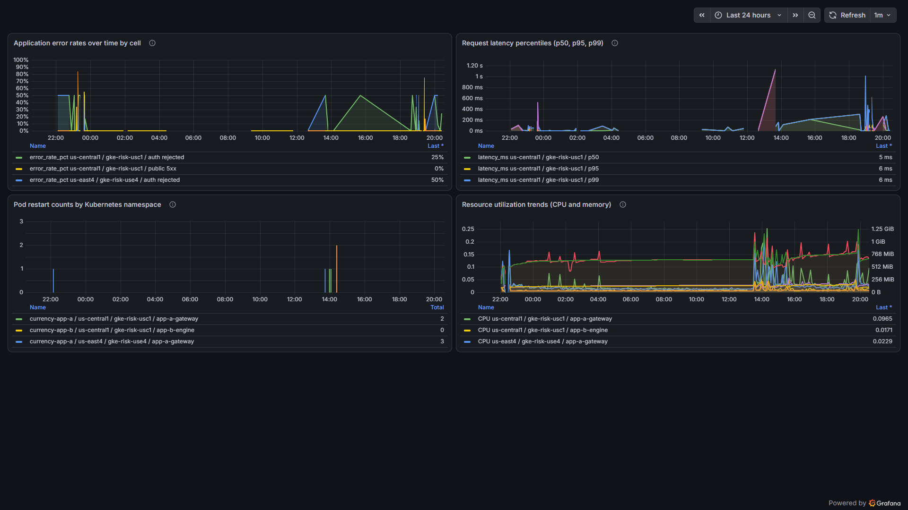

# Evidence handoff

## Evidence identity

- Capture date: 2026-08-13 UTC
- App A and App B release: `30fd8e9d60050f4b8cc93f25879883264a8ac30e`
- Project: `schwab-assessment-gke`
- Cells: `us-central1` and `us-east4`

This is point-in-time proof for one immutable release. The application,
telemetry, dashboard, and platform claims below were checked against that
release; source presence alone is not treated as runtime proof.

## Reviewer evidence matrix

| Claim | Result | Reviewer artifact |
|---|---|---|
| Accessible public UI | The synthetic rate board loaded through the public endpoint and exposed only the serving region and trace ID, not cluster, internal-service, or image metadata. Automated JSON, header, version, and backend checks provide the stronger behavior proof. | [`screenshots/05-public-endpoint.png`](screenshots/05-public-endpoint.png) |
| Budget guardrail | A $30 monthly safety budget has 50%, 80%, 90%, and 100% current-spend alert thresholds. The image renders validated CLI data; it does not claim current spend. | [`screenshots/01-budget.png`](screenshots/01-budget.png) |
| Two ready cells and immutable images | Each cell ran three ready App A Pods and two ready App B Pods at the exact release SHA. | Summarized here; raw operational output remains outside the package. |
| Private, authenticated App B | Signed App A calls succeeded in both cells; direct unauthenticated App B calls returned empty `401` responses. App B had no public endpoint. | Summarized here; raw operational output remains outside the package. |
| Team isolation | Restricted Pod Security, quotas, NetworkPolicy, KSA/GSA mappings, namespace deployers, and own-versus-peer denial checks passed in both cells. Secret, exec, attach, policy/RBAC, peer-namespace, and Dev production access were denied. | Summarized here; raw operational output remains outside the package. |
| HTTPS edge and zonal endpoints | The managed certificate was active, no public HTTP frontend existed, and all six central `b/c/f` and east `a/b/c` App A NEGs had a ready endpoint. | Summarized here; raw operational output remains outside the package. |
| Structured application logs and BigQuery | App A and App B emitted typed, same-trace JSON logs. The packaged parameterized SQL covers trace lookup, errors, latency, regional traffic, and authentication rejection; current request and latency rows from both cells populated Grafana. | [`bigquery/schema.json`](bigquery/schema.json), [`BIGQUERY.md`](BIGQUERY.md), and [`grafana-dashboard.png`](grafana-dashboard.png) |
| Direct Cloud Trace | Trace `8a7d9229359fb6fbe0ff27aa043f09e9` proved the exact current-release parent chain in `us-central1`: App A server span -> App A client span -> App B server span. Both workloads exported directly with keyless identities. | [`screenshots/19-cloud-trace.png`](screenshots/19-cloud-trace.png) |
| Java Cloud Profiler | The live gate paged through 10 metadata pages and retained 12 sanitized current-version summaries: the latest CPU and HEAP profile in each of six configured zones. No equivalent .NET App B profiling claim is made. | [`screenshots/19-cloud-profiler.png`](screenshots/19-cloud-profiler.png) |
| Cloud-hosted four-panel Grafana | A private one-hour Grafana Job ran in GKE from the release image digest. Its signed BigQuery plugin and keyless read-only identity returned real error, latency, restart, CPU, and memory data. The Job had no public Service, Ingress, Secret, or PVC and was removed after capture. | [`grafana-dashboard.png`](grafana-dashboard.png), [`grafana-dashboard.json`](grafana-dashboard.json), and the interpretation below |
| Bounded platform observability | The live gate found fresh GKE control-plane, node, HPA, load-balancer, VPC-flow, and firewall logs; zero unhealthy nodes; HPA decision data; and HTTPS request, 5xx, and latency metrics. The separate 30-day platform dataset contained fresh sampled load-balancer rows. | [`BIGQUERY.md`](BIGQUERY.md) and this summary |
| Controlled regional failover | The exercise uses a reversible cell-local App B fault, verifies survivor traffic, restores the fault configuration, and does not pass until both cells and all six backends recover. The measured claim is bounded automatic recovery, not zero downtime or one-region peak-capacity proof. | Summarized here; raw request data remains outside the package. |
| Grouped application errors | Error Reporting grouped the intentional controlled fault as `InjectedExchangeRateFaultException` on `app-b-engine` and its propagated `DependencyUnavailableException` on `app-a-gateway`. Unrelated `k8s_pods` system groups visible in the Console are not application claims. | [`screenshots/11-error-reporting.png`](screenshots/11-error-reporting.png) |

Detailed CLI output, trace/profile payloads, and failover CSVs remain outside
the reviewer package. The package carries only the evidence needed to review
the design without publishing operational data.

## Cloud Trace and Profiler captures

[](screenshots/19-cloud-trace.png)

The signed-in Cloud Trace timeline shows the three spans and their nesting for
trace `8a7d9229359fb6fbe0ff27aa043f09e9`. The automated gate verified the full
trace ID, exact parent IDs, region, services, and release metadata.

[](screenshots/19-cloud-profiler.png)

The signed-in Cloud Profiler view shows `app-a-gateway`, CPU time, the exact
`30fd` release, a one-hour window, all zones, and the live flame graph. The
automated gate separately verified current CPU and HEAP summaries in all six
zones without retrieving profile bytes.

## Error Reporting capture

[](screenshots/11-error-reporting.png)

The two current application rows are intentional injected-fault proof:
`InjectedExchangeRateFaultException` shows App B grouping the controlled fault,
and `DependencyUnavailableException` shows App A grouping the resulting
dependency failure. The other visible `k8s_pods` rows are unrelated system
groups and are not used as application, release-health, or availability claims.
The final verification gates restored the fault configuration and required both
cells and all six load-balancer backends to be healthy.

## Grafana dashboard interpretation

[](grafana-dashboard.png)

The 24-hour dashboard includes deliberate assessment activity, not a
steady-state production baseline:

- Error-rate spikes include intentional unauthenticated and signed-path
  negative tests plus controlled App B fault injection that produced expected
  public `5xx` responses.
- Restart spikes include immutable release rollouts and startup-probe
  hardening. A restart series is not, by itself, an application outage.
- CPU, memory, and latency spikes include evidence traffic, rollouts, and the
  failover/fault exercises.

Not every spike represents a fault. The verification workflows restore their
controlled configuration, then require ready workloads, successful signed
calls, healthy public responses, and all six load-balancer backends before
passing.

## Claim exclusions

- Cloud Armor and Binary Authorization are implemented behind flags but were
  disabled in the snapshot. No live WAF, rate-limit, attestation, or admission
  enforcement is claimed.
- Trace export is asynchronous and sampled, so it is diagnostic telemetry, not
  a complete audit record.
- Grafana was cloud-hosted in private GKE for a bounded evidence session. It is
  not a durable shared service or public dashboard with SSO.
- Sampled platform logs bound volume and cost; they are not complete forensic
  accounting.
- Zero downtime, hostile-tenant isolation, mTLS, database replication, remote
  Terraform state, and peak survivor capacity are not claimed.

## Integrity and handling

[`SHA256SUMS.txt`](SHA256SUMS.txt) covers every delivered screenshot and
diagram, the Grafana dashboard export, the sanitized live schema, and all
delivered SQL. From this directory, verify it with:

```bash
sha256sum --check SHA256SUMS.txt
```

The package contains no assignment PDF, credentials, tokens, service-account
keys, kubeconfig, Terraform state, raw logs, raw query results, trace/profile
payloads, or raw failover request dataset.
