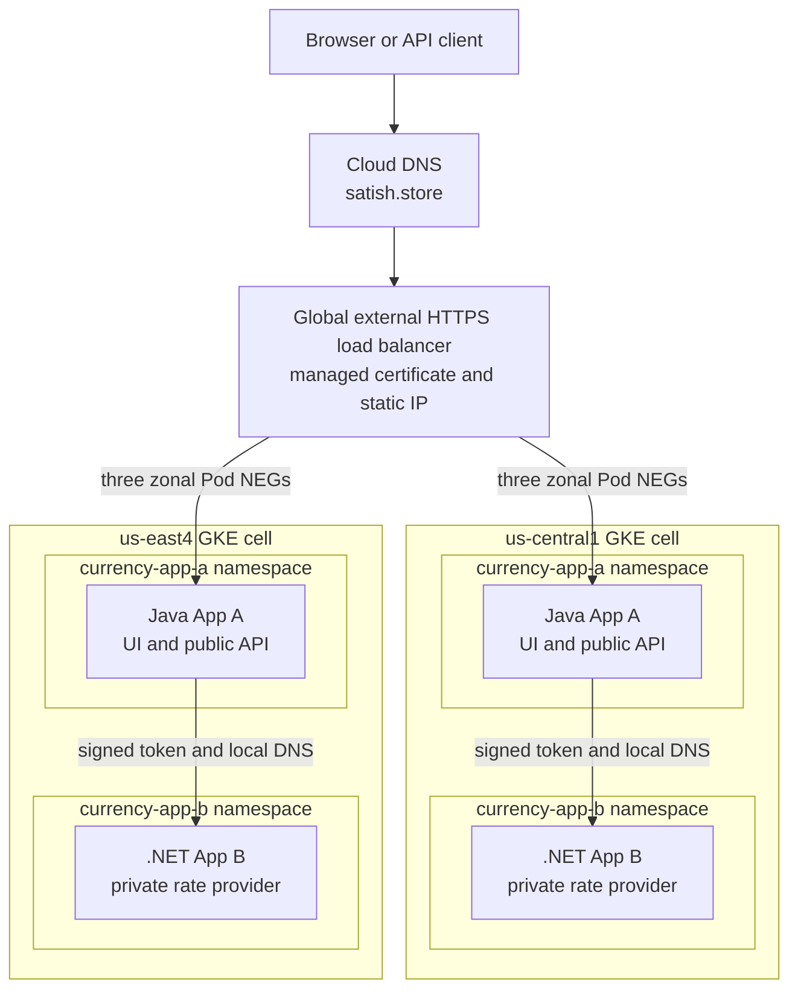
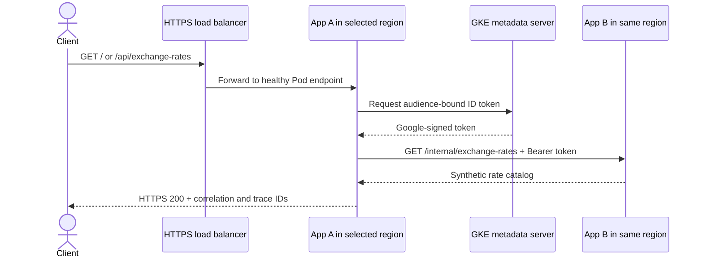
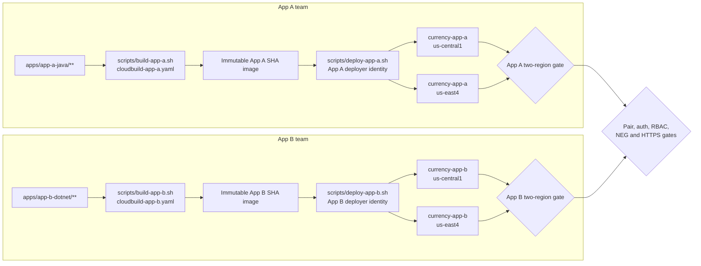
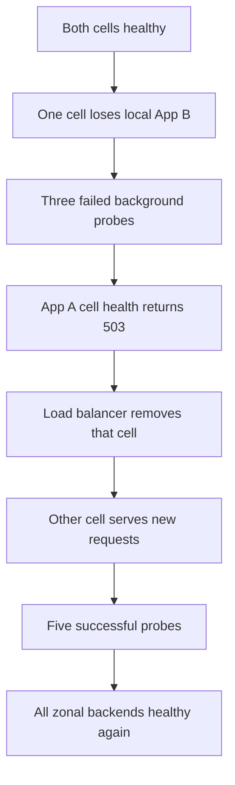

# Architecture

The system uses two active regional GKE cells behind one global HTTPS endpoint.
Each cluster is shared by two trusted application teams, but App A and App B
have separate namespaces, deployment identities, and release paths.

## Runtime architecture

The load balancer reaches six GKE-managed zonal Pod NEGs directly. Terraform
owns the edge and attaches those NEGs after Kubernetes creates and populates
them. This avoids Fleet/MCI/MCS, but requires the Kubernetes/NEG gate before the
load-balancer stack.

## Request and identity flow

App B has no public endpoint. Its NetworkPolicy accepts traffic only from App A
Pods in `currency-app-a`, and it separately verifies the token signature,
issuer, audience, lifetime, and caller email. NetworkPolicy limits the path;
the signed token authenticates the workload.

## Team and security boundaries

The platform layer owns namespaces, restricted Pod Security labels, Services
and NEG annotations, service accounts, NetworkPolicies, quotas, RBAC, and cell
configuration. App pipelines can change only their Deployments, HPAs, PDBs,
and no platform-owned object.

| Role | Implemented identity and access |
|---|---|
| Dev | Repository review and lower environments only; no production GCP or Kubernetes principal is provisioned |
| Ops | `satish.cse7@gmail.com`; platform/Terraform operator and current project Owner, disclosed as an assessment limitation |
| SRE | `grafana-reader`; keyless read access to the required BigQuery and Monitoring data |
| CI/CD | Shared `risk-cloud-build` image builder plus `currency-app-a-deployer` and `currency-app-b-deployer`, each writable only in its own namespace |

This is cooperative multi-tenancy for trusted internal teams. The project,
clusters, nodes, VPC, edge, build identity, Artifact Registry repository,
logging, BigQuery, Grafana, and cluster administrator remain shared. Separate
clusters/projects and per-team build repositories are the stronger boundary
for regulated or mutually untrusted workloads.

## Independent delivery

The assessment fast path launches both app lanes and both regional applies in
parallel, then treats the combined gate as authoritative. Each lane uses its
own identity, kubeconfig, and work directory and can restore only its own
previous immutable image. This is appropriate before reviewer traffic begins;
a production rollout would normally use progressive regions or a canary to
reduce blast radius. `cloudbuild-release.yaml` remains the coordinated build
for a known-compatible pair, and breaking APIs still require expand-contract.

A deployment passes only when:

1. App tests, formatting, immutable-tag checks, and the vulnerability gate pass.
2. The deployer is allowed in its own namespace and denied policy, Secret,
   exec, and peer-namespace access.
3. Both regional rollouts reach the exact requested image and ready replicas.
4. Signed App A-to-App B calls return `200`; anonymous App B calls return `401`.
5. App A cell health and all six zonal NEG backends are healthy.
6. The public HTTPS response has the expected App B version and trace headers.
7. An independent lane leaves the other app's image unchanged.

## Regional failover

The verified outcome and timings are recorded in
[`EVIDENCE.md`](EVIDENCE.md). The claim is automatic recovery with bounded
transition impact, not zero downtime. Capped retries for idempotent GETs with
exponential backoff and jitter, faster health convergence, and pre-provisioned
survivor capacity could reduce errors; that production SLO work is out of
scope.

## Remaining production boundaries

The internal hop is HTTP plus a signed token, not mTLS. Default-deny egress,
Cloud Armor enforcement, Binary Authorization enforcement, remote Terraform
state, hosted Grafana with SSO, formal SLOs, and one-region peak-capacity proof
remain deferred or disabled. See [`FINOPS_AND_SCOPE.md`](FINOPS_AND_SCOPE.md)
for the cost and production tradeoffs.
