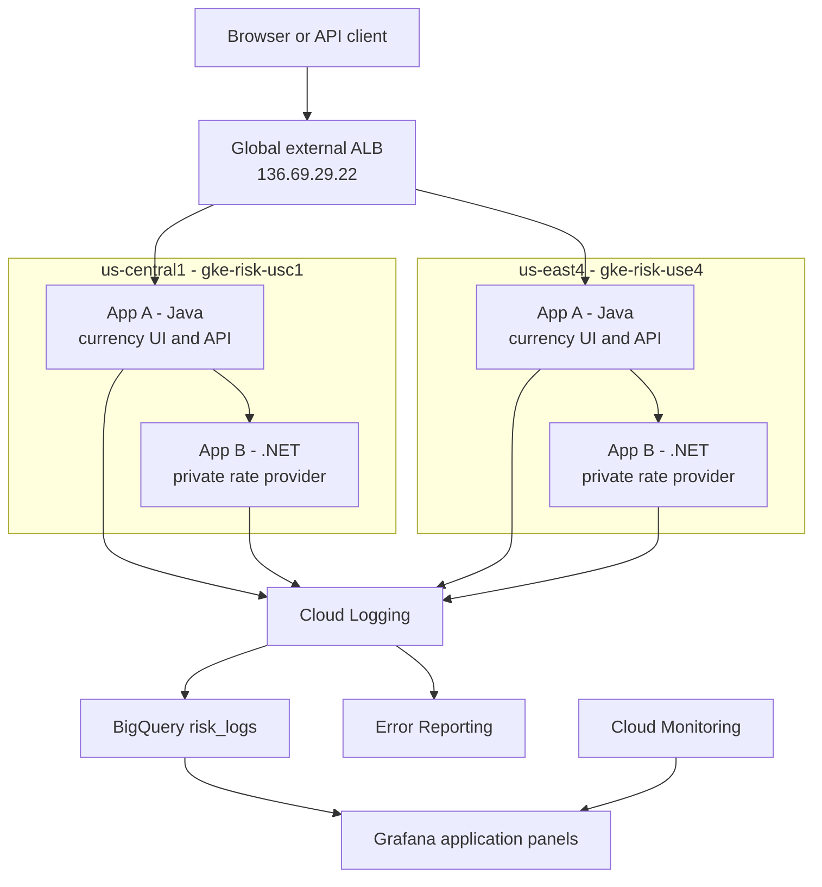

# Architecture

## Why standalone zonal NEGs

The implementation uses one Terraform-managed global external Application
Load Balancer and six standalone zonal GKE Pod NEGs instead of Multi Cluster
Ingress or multi-cluster Gateway. This keeps the complete load-balancer graph
in Terraform, avoids Fleet/Multi-cluster Services setup, and preserves the
chosen Kubernetes NetworkPolicy model.

Terraform does not create or populate the NEGs. Kubernetes declares the named
App A Service exposure, and GKE creates and synchronizes the zonal NEGs.
Terraform validates and attaches those six existing groups. This is
infrastructure as code across two control planes, not a claim that Terraform
owns every object.

There is no Kubernetes Ingress, Gateway, or multi-cluster ingress controller in
the request path. The Terraform load balancer addresses the GKE-managed Pod
NEGs directly; that control-plane difference from the assignment example is
intentional and disclosed in `PLAN_VS_ASSIGNMENT.md`.

The tradeoff is more orchestration and a strict apply order. Regional Autopilot
placement first left some zones without a real endpoint, so App A now has one
zonal shard Deployment in each frozen zone. Each shard scales from one to two
Pods, giving three to six App A Pods per region and one real endpoint in each
NEG. This is deterministic, but it costs two extra minimum App A Pods and uses
three small HPAs per region.

## Request and health flow



```text
client
  -> GET / or GET /api/exchange-rates on https://satish.store:443
  -> EXTERNAL_MANAGED load balancer
  -> one of six healthy App A Pod NEG endpoints
  -> Java App A in that regional cell
  -> local app-b-engine ClusterIP
  -> GET /internal/exchange-rates on .NET App B in the same regional cell
```

App B has no public endpoint, Ingress, load-balancer NEG, or cross-cluster
route. The two cells share the global frontend and versioned desired state, but
not an application dependency path or datastore.

Both cells are active-active: while healthy, either region can receive a new
request. There is no strict primary. The load balancer uses `/health/cell`,
which returns App A's cached view of a background exchange-rate probe to local
App B. It never calls App B synchronously.

Kubernetes uses `/health/ready`, which does not depend on App B. A local App B
failure therefore leaves App A Pods ready while `/health/cell` turns unhealthy
after three failed probes. The load balancer drains that cell. Recovery waits
for five successful probes before the cell becomes eligible again; this slower
path limits flapping.

The measured test faulted `us-central1`. The cache marked the cell unhealthy in
47.961 seconds and the edge drained it in 62.935 seconds. `us-east4` produced
six confirmed successes after drain. Cache and edge recovery took 59.471 and
73.792 seconds respectively, and all six backends returned healthy. Sixteen of
167 requests failed during drain; the design does not claim zero downtime.

## Isolation and ownership

Namespace ingress is denied by default. App A accepts port 8080 only from the
documented Google frontend and health-check ranges. App B accepts port 8080
only from App A Pods in `risk-system`. Both containers run non-root with a
read-only root filesystem, dropped capabilities, no privilege escalation, and
RuntimeDefault seccomp.

Default-deny egress is deliberately not enabled. Adding it without tested DNS,
metadata, identity, registry, and telemetry allowances creates a larger outage
risk than it removes in this short assessment. A production rollout should add
and verify those paths before enforcing egress denial.

Ownership is split by dependency boundary:

- `00-bootstrap`: APIs and the $30 budget.
- `10-global`: VPC, ranges, registry, global IP, log sink, BigQuery, and IAM.
- `20-cluster`: two regional Autopilot clusters.
- Kubernetes/Kustomize: workloads, Services, health, scaling, policies, and
  fault profiles; GKE owns NEG lifecycle.
- `30-lb`: health check, backend service, six NEG attachments, proxies, URL
  maps, and forwarding rules.

The stacks currently use ignored local Terraform state. That was acceptable
for a single-machine assessment, but it is not a team-safe production backend.

## Failure boundaries

A failed App B Pod stays inside its local ClusterIP. Failure of the whole local
rate-provider path drains App A for that cell; the other cell has its own cluster,
App B replicas, and NEGs. A failed App A endpoint is removed independently.
Logging, BigQuery, Monitoring, and Grafana are outside the request path.

The surviving region was sized for the bounded assessment load. HPA is not
instant failover capacity; production capacity must be pre-provisioned and
tested against peak regional traffic.

The current public origin remains HTTP only until the approved currency image
is deployed. The owned root domain `satish.store`, Cloud DNS authorization, and
Google-managed certificate are ready; Terraform then adds port 443 and removes
the old port 80 frontend without putting a private key in state. Internal
load-balancer health checks and App A-to-App B calls remain HTTP inside the
private service path.
