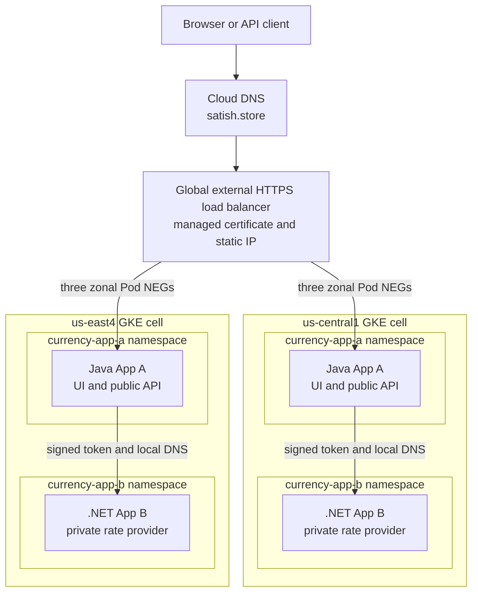
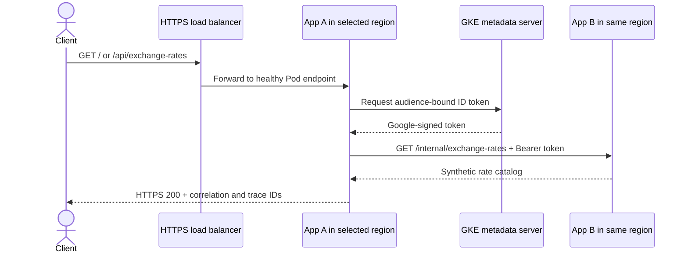
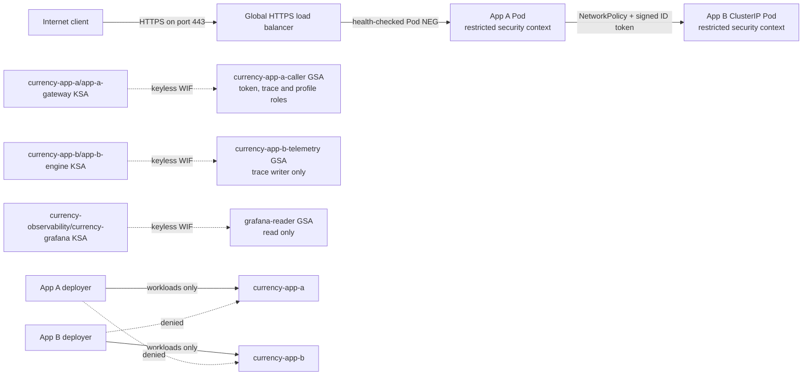
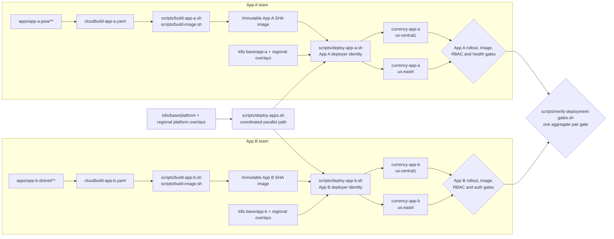
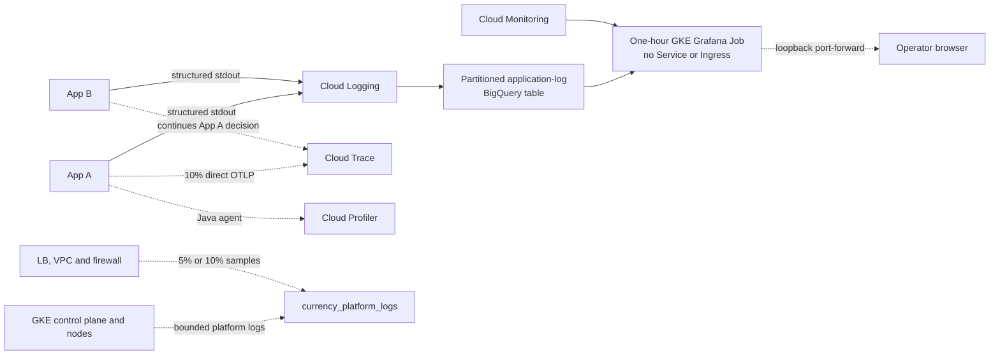
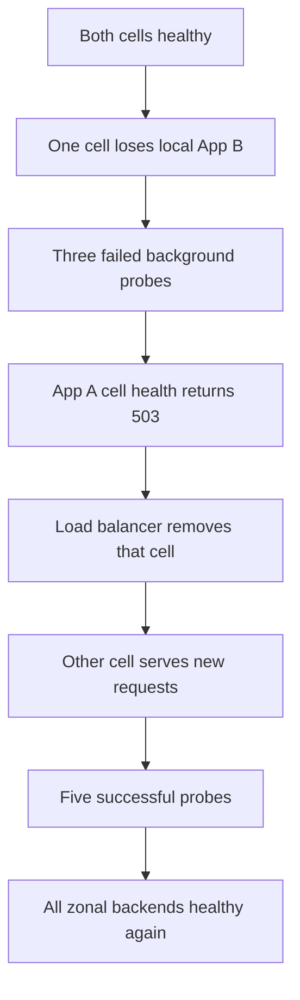

# Architecture

The system uses two active regional GKE cells behind one global HTTPS endpoint.
Each cluster is shared by two trusted application teams, but App A and App B
have separate namespaces, deployment identities, and release paths.

The measured live image tag is `30fd8e9d60050f4b8cc93f25879883264a8ac30e`.
Its files are byte-identical to sanitized public commit
`a03a5fb1c174cdeac87638b39acc3b7c401545b0`; only publication history changed.
Release-matched evidence proves direct tracing, Java Profiler, bounded platform
telemetry, and the private one-hour GKE Grafana job shown below. Both regional
clusters also passed the focused final cluster and logging contract.

## Runtime architecture

The load balancer reaches six GKE-managed zonal Pod NEGs directly. Terraform
owns the edge and attaches those NEGs after Kubernetes creates and populates
them. There is no GKE Ingress controller in this path: App A Services register
the Pod NEGs, and the Terraform load balancer uses those endpoints directly.
This avoids Fleet/MCI/MCS, but requires the Kubernetes/NEG gate before the
load-balancer stack. Cloud DNS is authoritative for the public hostname;
cell-local App A-to-App B discovery uses Kubernetes DNS.

## Request and identity flow

App B has no public endpoint. Its NetworkPolicy accepts traffic only from App A
Pods in `currency-app-a`, and it separately verifies the token signature,
issuer, audience, lifetime, and caller email. NetworkPolicy limits the path;
the signed token authenticates the workload.

## Security and identity flow

There are no service-account keys or application Secrets. App deployers cannot
change Services, service accounts, NetworkPolicies, quotas, RBAC, Secrets, Pod
exec/attach, the peer namespace, or the observability namespace. Dev has no
production principal. The standing project Owner remains the main assessment
exception.

## Team and security boundaries

The platform layer owns namespaces, restricted Pod Security labels, Services
and NEG annotations, service accounts, NetworkPolicies, quotas, RBAC, and cell
configuration. App pipelines can change only their Deployments, HPAs, PDBs,
and no platform-owned object.

| Role | Implemented identity and access |
|---|---|
| Dev | Repository review and lower environments only; no production GCP or Kubernetes principal is provisioned |
| Ops | `satish.cse7@gmail.com`; platform/Terraform operator and current project Owner, disclosed as an assessment limitation |
| SRE | `grafana-reader`; read-only BigQuery/Monitoring access with an exact keyless Grafana KSA mapping |
| CI/CD | Shared image builder plus `currency-app-a-deployer` and `currency-app-b-deployer`, each writable only in its own namespace |

This is cooperative multi-tenancy for trusted internal teams. The project,
clusters, nodes, VPC, edge, build identity, Artifact Registry repository,
logging, BigQuery, Grafana, and cluster administrator remain shared. Separate
clusters/projects and per-team build repositories are the stronger boundary
for regulated or mutually untrusted workloads.

## Independent delivery

Each lane independently owns its image and namespace. A direct single-app lane
uses its own identity, kubeconfig, work directory, compatibility gate, and
rollback image. `scripts/deploy-apps.sh` is the safe parallel orchestrator: it
applies a fresh or symmetrically expanded platform, starts both lane scripts
with their combined gates deferred, waits for both, then runs one aggregate
pair gate. Arbitrary concurrent direct invocations are not supported because
their gates and rollback decisions could race. `cloudbuild-release.yaml`
remains an optional coordinated build. Breaking APIs require expand-contract;
a regulated production rollout would normally add a canary or progressive
regions.

A deployment passes only when:

1. App tests, formatting, immutable-tag checks, and the vulnerability gate pass.
2. The deployer is allowed in its own namespace and denied policy, Secret,
   exec, and peer-namespace access.
3. Both regional rollouts reach the exact requested image and ready replicas.
4. Signed App A-to-App B calls return `200`; anonymous App B calls return `401`.
5. App A cell health and all six zonal NEG backends are healthy.
6. The public HTTPS response has the expected App B version and trace headers.
7. An independent lane leaves the other app's image unchanged.

## Observability flow

The trace exporter is asynchronous and has a two-second export timeout;
telemetry failure does not fail a request. App A makes the 10% sampling
decision and ignores an untrusted caller's sampled flag; App B continues that
decision. Health probes and rejected authentication attempts are excluded.
The platform sink is separate from application stdout and uses short retention
and bounded samples. None of these systems is in the customer request path.

The Grafana image bakes its checksum-pinned BigQuery plugin during a
dedicated Artifact Registry build. Its explicit release-SHA tag is resolved to
one digest before the Job manifest is rendered; the runtime downloads neither
the plugin nor a Docker Hub image.

## Regional failover

The verified outcome and timings are recorded in
[`EVIDENCE.md`](EVIDENCE.md). The claim is automatic recovery with bounded
transition impact, not zero downtime. Capped retries for idempotent GETs with
exponential backoff and jitter, faster health convergence, and pre-provisioned
survivor capacity could reduce errors; that production SLO work is out of
scope.

## Remaining production boundaries

The internal hop is HTTP plus a signed token, not mTLS. Default-deny egress,
Cloud Armor enforcement, Binary Authorization enforcement, remote Terraform
state, durable Grafana with SSO, formal SLOs, and one-region peak-capacity proof
remain deferred or disabled. For regulated or mutually untrusted workloads,
separate projects, clusters, build identities, and registries are the stronger
boundary. See [`FINOPS_AND_SCOPE.md`](FINOPS_AND_SCOPE.md).

Exact frozen cloud-resource identifiers are intentionally omitted from this
architecture view. They remain in [`CONTRACTS.md`](../CONTRACTS.md) and
[`BIGQUERY.md`](BIGQUERY.md), where operators need them.
